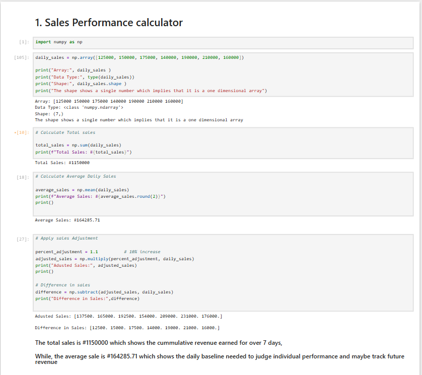
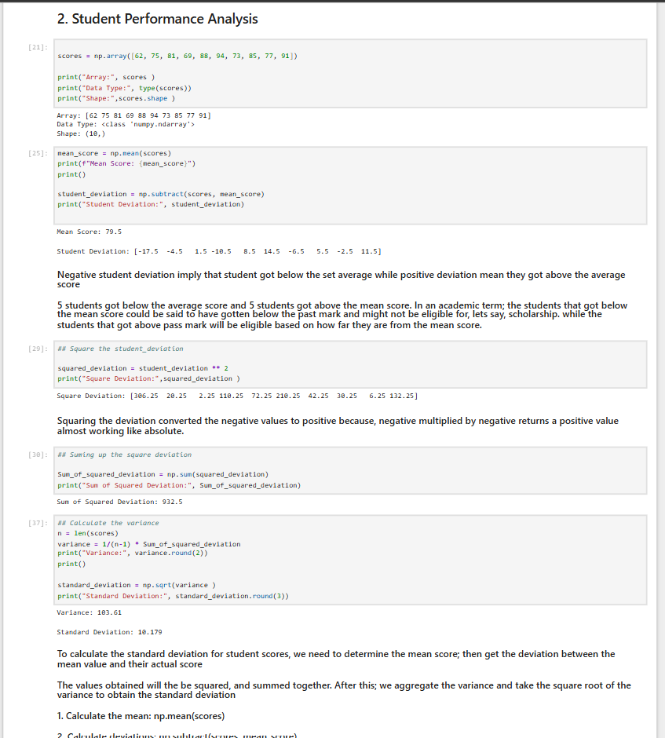
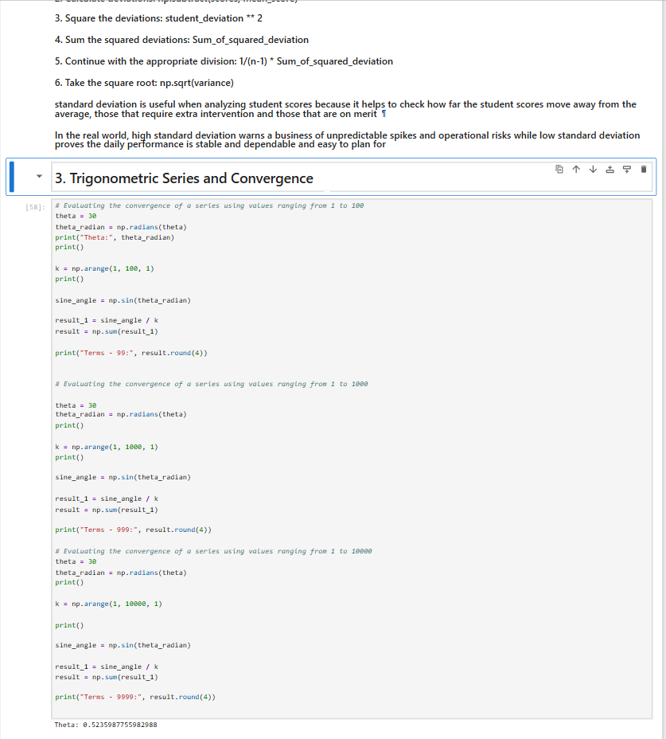
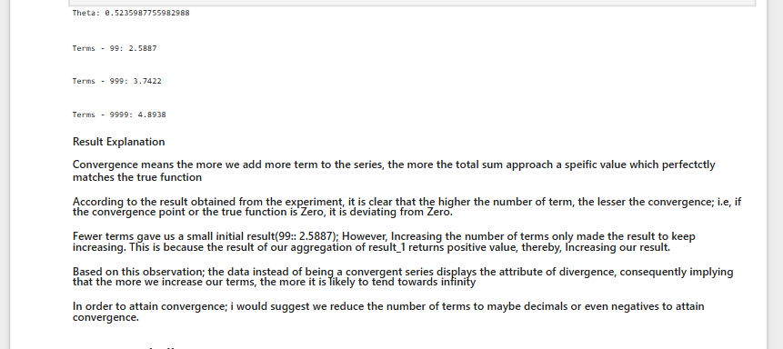
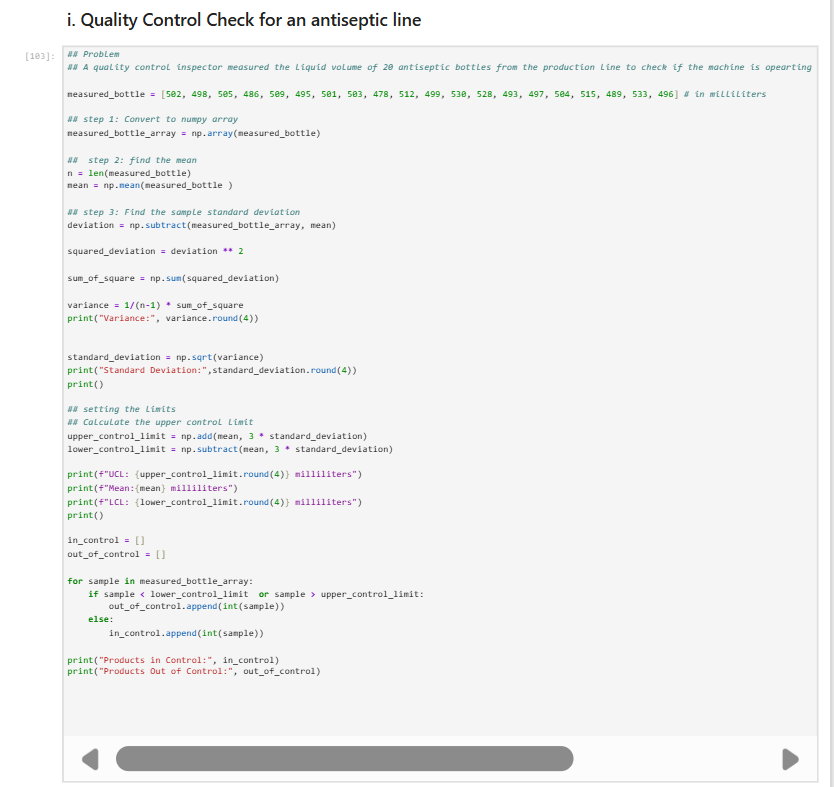
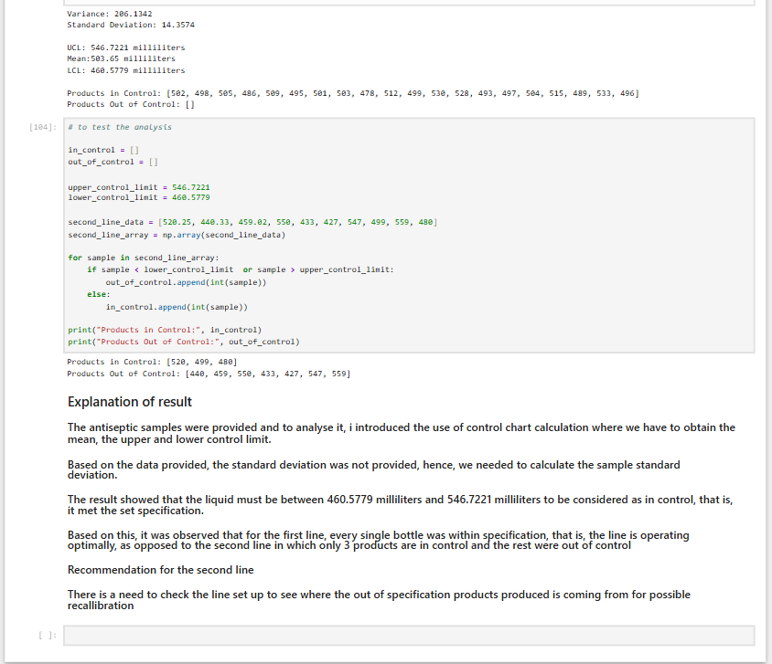

# Numpy-Industy-Application-Practice

Businesses, educational institutions, and manufacturing production lines generate diverse numerical data requiring rapid computation, statistical evaluation, and quality control monitoring. Using standard Python lists for these repetitive numerical operations often results in inefficient processing or unintended list concatenation rather than mathematical aggregation. To solve this, the NumPy library is utilized for high-speed, vectorized numerical computations across multiple operational scenarios

# Objective
* To develop a suite of NumPy-powered computational modules designed to:Calculate and project sales performance metrics and   percentage adjustments.
* Perform statistical analysis on student exam scores by evaluating mean, deviation, variance, and standard deviation.
* Evaluate the convergence behavior of trigonometric series across varying term counts.
* Execute quality control checks on antiseptic production lines by establishing control limits (UCL and LCL) to flag          out of control product batches.
---

# Dataset
* The project utilizes four distinct simulated datasets embedded within the code:Daily Sales Data: 7-day sales figures [125000, 150000, 175000, 140000, 190000, 210000, 160000].

* Student Exam Scores: 10 student score records [62, 75, 81, 69, 88, 94, 73, 85, 77, 91].
  
* Trigonometric Series Data: Angle evaluation at $30^\circ$ evaluated across series term ranges up to 99, 999, and 10,000     terms.
  
*  Antiseptic Bottle Volumes: Liquid volume measurements from 20 production line bottles [502, 498, 505, 486, 509, 495,        501, 503, 478, 512, 499, 530, 528, 493, 497, 504, 515, 489, 533, 496] alongside a secondary test line dataset.
  
---

# Code

# Results
* Sales Performance: Total Sales = #1150000, Average Sales = #164285.71.
* Adjusted sales computed with a 10% increase yielded values scaling up correctly per day.
* Student Performance: Mean Score = 79.5, Variance = 103.61, Standard Deviation = 10.179.
* Trigonometric Series: Series sums evaluated at term counts of 99, 999, and 10,000 yielded results of 2.5887, 3.7422, and    4.8938 respectively.
* Quality Control: Mean = 503.65, Variance = 206.1342, Standard Deviation = 14.3574, UCL = 546.7221, LCL = 460.5779.
  Primary production line products were entirely in control, whereas the test secondary line showed 3 products in control     and 7 out of control.
  
  ---

# Interpretation
* **Sales:** The cumulative revenue over 7 days is #1150000, establishing a daily baseline average of #164285.71 to monitor   individual performance and track future revenue.
* **Student Scores:** Negative deviations indicate scores below the class mean, while positive deviations indicate scores     above average. Standard deviation highlights score dispersion, helping identify candidates for scholarships or academic     intervention.
* **Trigonometric Series:** As the number of terms increases, the series sum continuously grows rather than converging to a   limit, displaying divergent behavior due to positive summation increments.
* **Quality Control:** Control charts successfully isolate product volumes falling outside the acceptable specification       window (between 460.5779 and 546.7221 milliliters). The primary line operates optimally, whereas the secondary line         requires immediate line setup checks and recalibration
  
---
# Conclusion
The NumPy-based analytical toolkit effectively processes multidimensional and vectorized numerical data across business finance, education, mathematical series evaluation, and manufacturing quality control. Utilizing NumPy arrays over native lists ensures high performance, accurate statistical aggregation, and robust threshold monitoring for operational decision-making

# Author
Latifat Oseni

